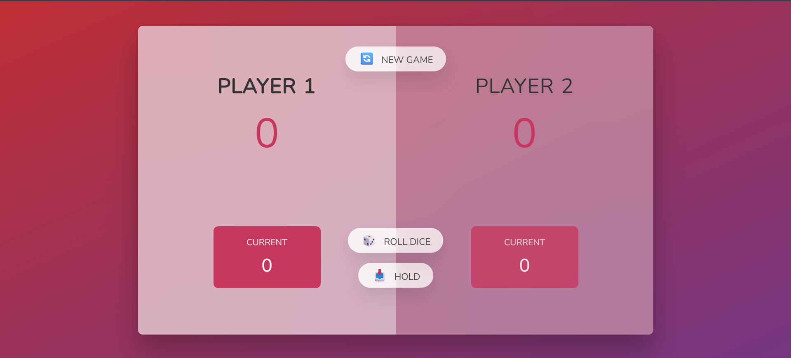

🎲 Pig Game

A simple browser-based dice game where two players take turns rolling. Each roll adds to a temporary score, but rolling a 1 resets it and passes the turn. Players can choose to hold and save their points, with the first to reach 30 winning the game.

🚀 Features
Two-player turn-based gameplay
Random dice roll simulation
Current score vs total score tracking
“Hold” mechanic to secure points
Automatic winner detection
Game reset functionality
🕹️ How to Play
Player 1 starts the game.
Click Roll Dice to roll.
Each roll adds to your current score.
If you roll a 1, you lose your current score and your turn ends.
Click Hold to add your current score to your total score.
First player to reach 30 points wins.
🛠️ Built With
HTML
CSS
JavaScript

📚 Learning Context

This project was built as part of my journey learning JavaScript, focusing on understanding core concepts like DOM manipulation, event handling, and managing application state through a simple interactive game.

🔄 Resetting the Game

Click the New Game button at any time to restart and reset all scores.

📌 Notes

This project focuses on basic JavaScript concepts such as:

DOM manipulation
Event handling
Game state management

